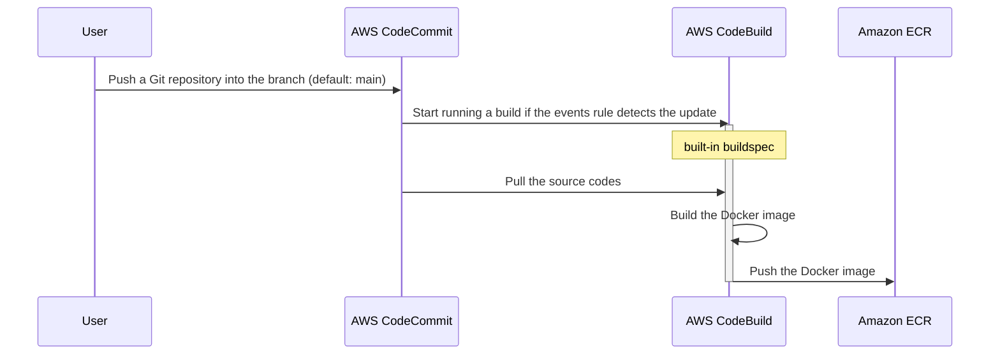

aws-cfn-image-builder
=====================

AWS CloudFormation stacks of CodeCommit-to-ECR integration to build and push a container image

[](https://github.com/dceoy/aws-cfn-image-builder/actions/workflows/lint.yml)



Installation
------------

1.  Check out the repository.

    ```sh
    $ git clone git@github.com:dceoy/aws-cfn-image-builder.git
    $ cd aws-cfn-image-builder
    ```

2.  Install [Rain](https://github.com/aws-cloudformation/rain), and set `~/.aws/config` and `~/.aws/credentials`.

3.  Deploy stacks for IAM roles.

    ```sh
    $ rain deploy \
        --params ProjectName=ib-dev \
        iam-roles-for-codebuild.cfn.yml ib-dev-iam-roles-for-codebuild
    ```

4.  Create a CodeCommit repository for Dockerfile and an ECR repository (if they don't exist).

    ```sh
    $ rain deploy \
        --params CodeCommitRepositoryName=your-codecommit-repo,EcrRepositoryName=your-ecr-repo \
        codecommit-and-ecr-repositories.cfn.yml \
        ib-dev-codecommit-and-ecr-repositories
    ```

5.  Deploy stacks for a CodeBuild project and an events rule.

    ```sh
    $ rain deploy \
        --params ProjectName=ib-dev,CodeCommitRepositoryName=your-codecommit-repo,EcrRepositoryName=your-ecr-repo,IamStackName=ib-dev-iam-roles-for-codebuild \
        codebuild-project-and-events-rule.cfn.yml \
        ib-dev-codebuild-project-and-events-rule
    ```

Usage
-----

1.  Push a Git repository including Dockerfile to the CodeCommit repository.
    (The example below requires [git-remote-codecommit](https://github.com/aws/git-remote-codecommit).)

    ```sh
    $ cd /path/to/your/git/project
    $ git push codecommit://your-codecommit-repo main:main
    ```

2.  Wait for a CodeBuild run to build and push a container image.
